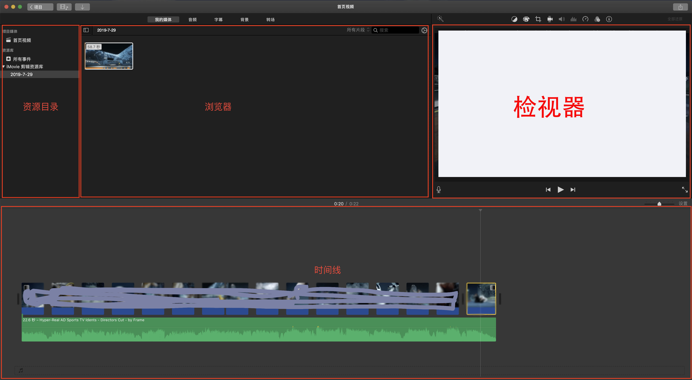
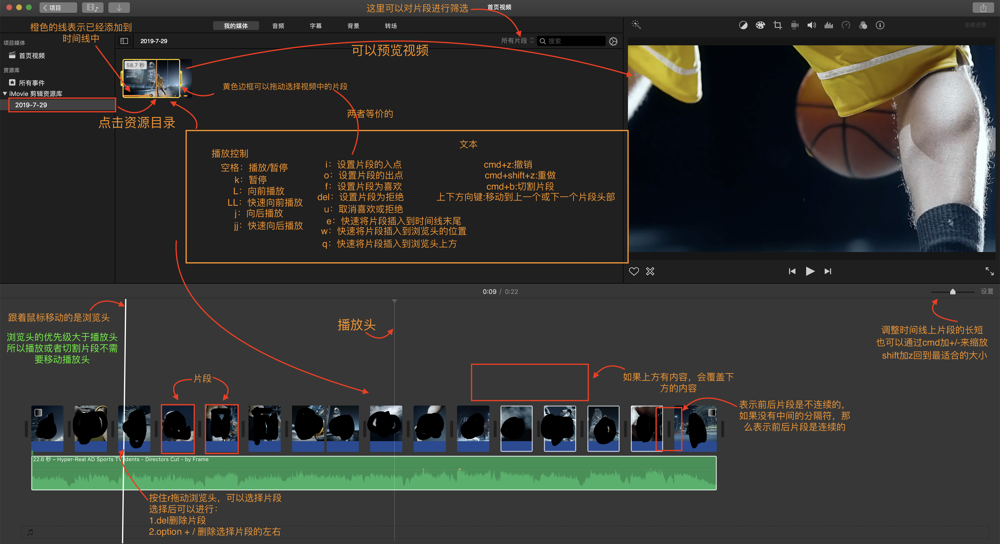
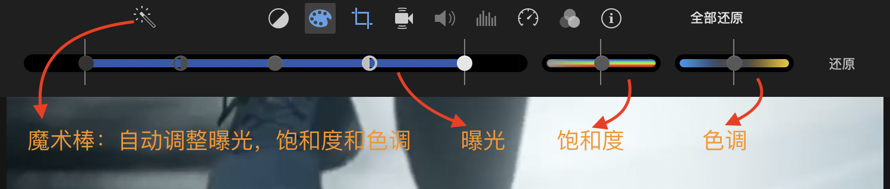
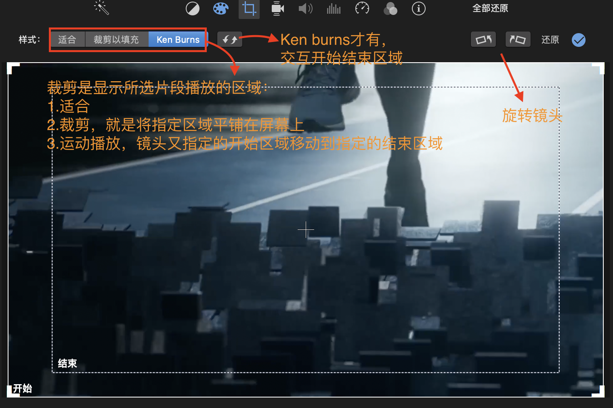
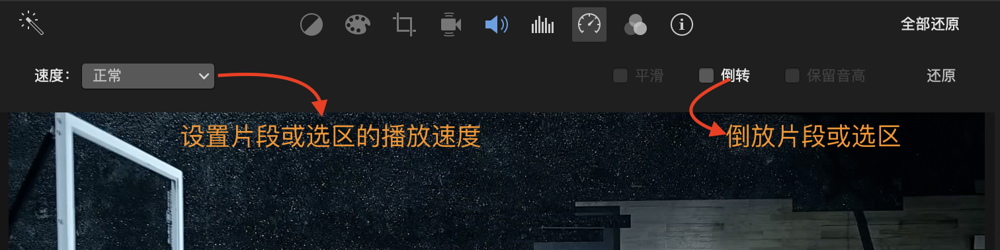

# imovie入门及提高

### 什么事imovie

> imovie是一款视频剪辑软件
>
> 苹果的理念：工具的使用不能影响创意的发挥

### iMovie的优势

* 即时保存
  自动保存，不需要手动ctrl+s
* 磁性时间线
  不同片段之间可以随意调整位置，片段左右的片段能够自动移动保证不留空隙
* 可延续性
  不受限于设备，不同设备可以共享素材和项目
* 免费

### 认识iMovie

iMovie界面分为四大区域：资源目录，浏览器，检视器以及时间线

资源目录区域显示所有可以用作素材的资源文件(视频片段或者音频文件)，一个完整的视频就是由不同的片段组合而成的。选择资源目录下的目录，在浏览器区域会显示目录下的资源文件，选择单个片段可以在检视器区域预览。如果需要将素材加入到编辑中，可以拖动素材到时间线区域，或者单击片段上的加号。

PS：只有在项目里才能看到时间线区域，否则时间线区域是隐藏的。只能浏览素材

时间线中添加素材除了从资源库中添加，还能直接从“访达”中直接拖拽进时间线。

### 使用iMovie

快捷键：

补充：

1. 按住k不松，使用j和l能够实现精细的移动
2. 按住k不松，按住j和l能够实现最小单元的连续播放
3. 快捷键`/`能够从片段头开始播放
4. cmd+l能够锁定片段循环播放
5. option+/ 修剪所选片段，能够将所选片段的前后剪切掉
6. 按住option不放，拖动其它的片段，可以复制一个同样的片段
7. cmd+T快速给片段前后添加转场动画（默认交叉叠化）；如果在片段的第一帧或最后一帧，那么是给前或者后单独添加转场
8. q键快速的将浏览器选中的资源（片段，音频，字幕，背景）放入时间线上方。
9. x选择所在片段

### 使用分镜头

当主片段上方有其它片段时，可以选择不同的方式展示

1. 切换镜头，默认项，上方片段会覆盖下方的片段。

2. 绿/蓝屏，这种是上方插入的片段中蓝色或绿色的部分会透明，可形成自动扣图的效果

3. 分屏，顾名思义，就是主片段和插入片段在左右或上下的分屏中播放显示

4. 画中画，就是将插入片段在屏幕中以小界面播放。类似新闻联播效果。

   PS：以上效果都需要配合“裁剪”功能来调整画面 或 通过iMovie的偏好设置来设置“照片布局”

### 关于音频

如何解决浏览时音频扰乱的问题：

1. 显示->音频浏览；取消可以将快速浏览时没有声音
2. shift+cmd+m 将所选的片段静音
3. cmd+option+b 将视频和音频分离，然后删除音频

### 其它

