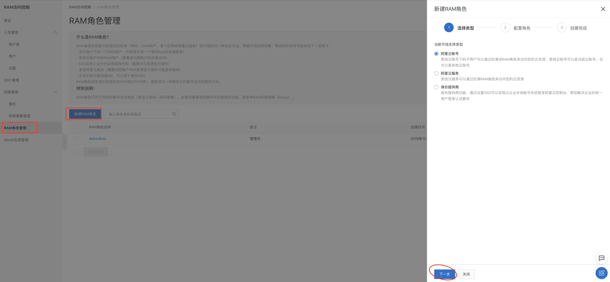
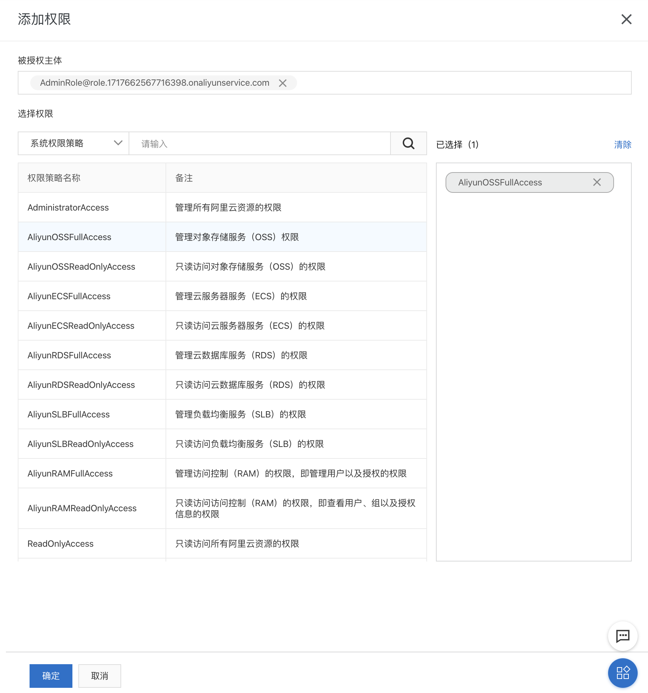
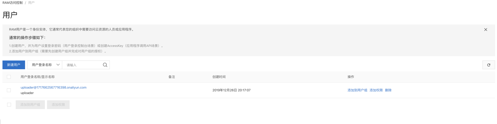
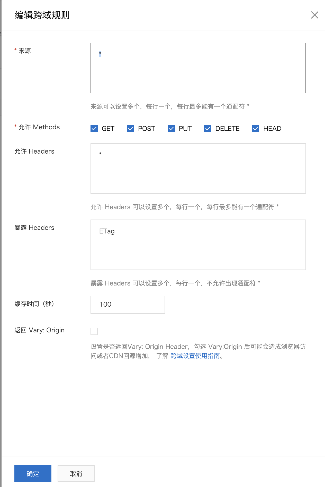
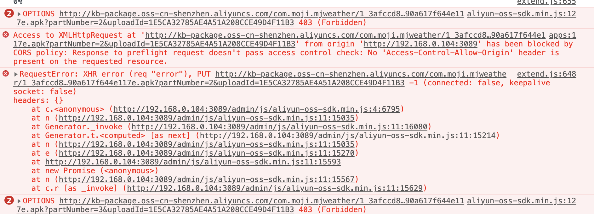
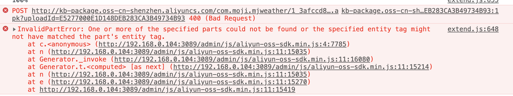

### STS方式从WEB端直传文件到阿里云OSS

1. 服务端

   服务端主要是提供STS（Security Token Service）临时授权访问OSS，这种方式实现了权限最小化的原则。使得不需要提供阿里账号的AcessKeyID和AcessSecretID，而且在服务端是可以进行权限的控制。

   STS需要配置RAM权限（参考下方STS配置）

   服务端实现代码

   ```javascript
   
   const OSS = require('ali-oss'); //引入阿里的库
   const STS = OSS.STS;
   const aliConfig = {
       accessKeyId: 'LTAI4FggNFakkZJm1tf2oxii',
       accessKeySecret: 'PxV6cTL4GN0UoyiApEVBquDDxW3V3N',
       bucket: 'kb-package',// bucket（cdn容器）
       region: 'oss-cn-shenzhen',// cdn服务器区域
       stsExpire: 15 * 60 //过期时间
   };
   const policy = {
       "Statement": [
           {
               "Action": "oss:*",
               "Effect": "Allow",
               "Resource": "*"
           }
       ],
       "Version": "1"
   }
   
   //roleArn 可以通过 RAM访问控制-〉角色管理->角色信息查看
   const roleArn = 'acs:ram::1717662567716398:role/adminrole';
   const sts = new STS({
       accessKeyId: aliConfig.accessKeyId,
       accessKeySecret: aliConfig.accessKeySecret
   });
   
   const aliyun = module.exports = {};
   
   aliyun.getToken =async () => {
       //这里需要特别注意：提供的accessKeyId对应的用户必须拥有，assumeRole的权限，否则调用会失败。
       let client = await sts.assumeRole(
           roleArn, policy, aliConfig.stsExpire); 
   
       return {
           region: aliConfig.region,
           bucket: aliConfig.bucket,
           accessKeyId: client.credentials.AccessKeyId,
           accessKeySecret: client.credentials.AccessKeySecret,
           securityToken: client.credentials.SecurityToken
       };
   }
   ```

   

2. STS以及OSS配置

   如果要使用STS，那么还需要RAM配合，需要提供RAM的角色，并且为该角色配置正确的权限。配置RAM步骤如下：

   * 登录阿里云账号

   * 鼠标移动到头像上，浮动菜单出现后，选择“访问控制”

   * 进入RAM访问控制后，选择“RAM”角色管理，然后“新建RAM角色”，创建一个新的角色。

     

   * 创建完角色后，需要为角色添加权限，否则授权的STS不能进行任何操作。如果需要上传文件，那么需要添加“AliyunOSSFullAccess”权限
     

   RAM访问控制中，还可以新增用户，例如：如上服务器需要一个用户仅仅用来提供sts临时授权，那么就可以单独新建一个用户专门提供sts临时授权，而不需要提供主账户的信息。

   

   需要注意：用户也需要配置权限，例如：如果用户只需要用来授权临时STS，那么只需要"[AliyunSTSAssumeRoleAccess](https://ram.console.aliyun.com/policies/AliyunSTSAssumeRoleAccess/System)"一个权限就好

   OSS设置，OSS设置主要是设置Bucket上的跨域问题，因为从web端上传文件时域名和ali的域名会存在一个跨域的问题，跨域设置如下：

   

   注意的是Methods需要都选中，否则会出现“option”请求403的问题。

   

   下面暴露Headers中的“ETag”也不能省略，否则会出现错误：

   

3. web前端

   引入oss库：

   ```
   <script src="/admin/js/aliyun-oss-sdk.min.js"></script>
   ```

   上传代码：

   ```javascript
   uploadToAli(options) {
     var file = options.file;
     var folder = options.folder;
     var key = options.key;
     // var next = options.next;
     var finished = options.finished;
     let currentCheckpoint;
     let uploadFileClient;
   
     if (folder) {
       key = folder + '/' + key;
     }
   
     $.ajax({
       url: '/admin/token/ali',
       type: 'post',
       dataType: 'json',
       success: function (data) {
         if (data.code === 0) {
           upload(data.data,file, key);
         } else {
           finished && finished({ code: -1, message: 'token获取失败' });
         }
       }
     });
   
     function upload(aliCreds, file, key) {
       const client = new OSS({
         region: aliCreds.region,
         accessKeyId: aliCreds.accessKeyId,
         accessKeySecret: aliCreds.accessKeySecret,
         stsToken: aliCreds.securityToken,
         bucket: aliCreds.bucket
       });
   
       const options = {
         progress
       };
   
       return client.multipartUpload(key, file, options).then((res) => {
         console.log('upload success:', res);
         currentCheckpoint = null;
         uploadFileClient = null;
       }).catch((err) => {
         if (uploadFileClient && uploadFileClient.isCancel()) {
           console.log('stop-upload!');
         } else {
           console.error(err);
         }
       });
     }
   
     const progress = async function progress(p, checkpoint) {
       currentCheckpoint = checkpoint;
       console.log(`${Math.floor(p * 100)}%`);
     };
   }
   ```

   