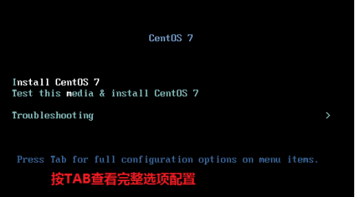
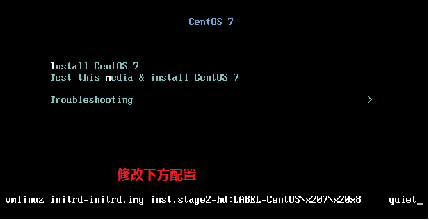
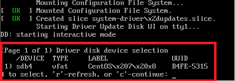

# Linux centos7.6安装

***

## 下载centos 7.6的安装包

进入[centos官网](https://www.centos.org/download/) ，官网会提供两个版本的安装文件`dvd iso`和`mininal iso`;dvd版本系统功能全，相应的安装包也很大。我只需要用来当web服务器使用，所以下载了mininal的版本。

## 制作安装U盘

使用光盘刻录工具将系统镜像克隆到u盘中，然后使用u盘安装

1. 准备

   * 大于8G的U盘
   * 官方镜像系统（已经准备的mininal）
   * 光盘刻录软件UltraISO

2. 制作安装系统U盘

   * 打开光盘刻录工具UltraISO，选择"文件->打开"，打开准备好的centos7.6的镜像文件

   * 插入U盘

   * UltraISO选择"启动->导出到硬盘"，硬盘驱动选择器选择U盘，其它选项不需要更改

   * 点击"写入"

     ***PS：写入操作会覆盖U盘中的所有文件，所以U盘中文件需要提前备份***

## 使用安装U盘安装系统

* 插入u盘到需要安装的电脑，启动电脑
* 按F2或DEL进入到BIOS系统中，设置启动项为u盘启动
* f10，重启电脑
* 重启电脑后，电脑会进入到centos系统的安装界面
  
* 按TAB键修改安装配置，将下方的 "vmlinuz initrd=initrd.img inst.stage2=hd:LABEL=CentOS\x207\x20x8 quiet"修改为"vmlinuz initrd=initrd.img linux dd quiet"，修改后按回车，系统会进入磁盘设备列表，**查看安装u盘的设备名**（这一步很重要）
  
* 本机设备名为 sdb4，这个不同电脑可能不一样，一定要查看并记录这个设备名
  
* 重新启动电脑，重新进入centos安装页面，然后按TAB修改配置，将 "vmlinuz initrd=initrd.img inst.stage2=hd:***LABEL=CentOS\x207\x20x8*** quiet" 需改为 " "vmlinuz initrd=initrd.img inst.stage2=hd:***/dev/sdb4*** quiet""。回车，开始安装系统
* 如果上面步骤没有错误，系统会进入图形化的安装
* 剩下的安装步骤就很简单了。

