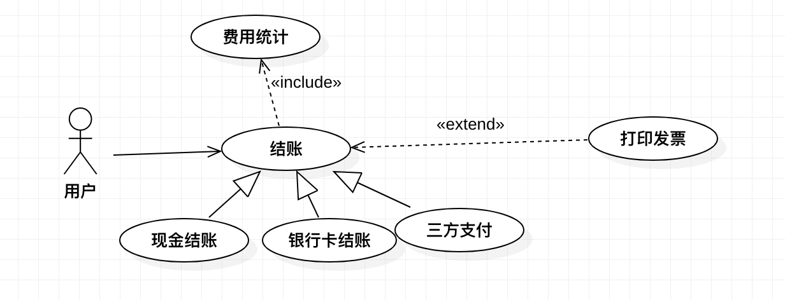

# 用例图

***

> 导语：用例图是项目初期，调研人员和客户在前期进行项目调研时绘制用来构建项目需求的一种，用例模型是外部参与者对系统功能的一个理解 ，而系统内部对参与者是透明的，调研人员通过用例图和用户进行沟通和确认。同时用例图的准确程度影响后续设计阶段的设计，能给项目管理人员快速了解项目并掌握项目的重心。

## 用例图的组成部分

### 参与者

参与者表示系统外部的使用者或者调用者，参与者可以是用户，也可以是其它系统或者硬件。参与者可以是不同的角色。

### 用例

用例是指系统中对外提供的功能或服务，其是系统中一个有意义的工作单元。

### 关联关系

关联关系是指参与者与可以使用的用例的关系

### 泛化关系

泛化关系可以存在于参与者之间，也可以存在于用例之间。

如果存在参与者之间，表示是对参与者角色的一个具体细化，比如说网页的浏览者，就可以泛化为匿名用户和登录用户

如果存在于用例之间，表示抽象用例可以具体化为多种具体用例，比如说，结账用例，就可以泛化为"现金结账"，"手银行卡结账"以及"第三方支付"

### 包含关系

包含关系存在于用例之间，表示A用例中使用了B用例，比如说：结账用例包含了费用统计用例，因为在结账的时候需要自动统计商品的总价值。

### 拓展关系

扩展关系用一个虚箭头外加版型《extend》表示，由扩展用例指向被扩展用例。如结账用例使用时，用户可以选择打印或不打印发票，这个不是必须的

拓展关系可以由如下几点确定：

* 表明用例的某一部分是可选的系统行为，这样就可以将用例图中的可选行为和必选行为分开。

* 表明只在特定条件下才执行的特定分支用例

* 表明多个基本用例中都有可能触发的某个可选用例

