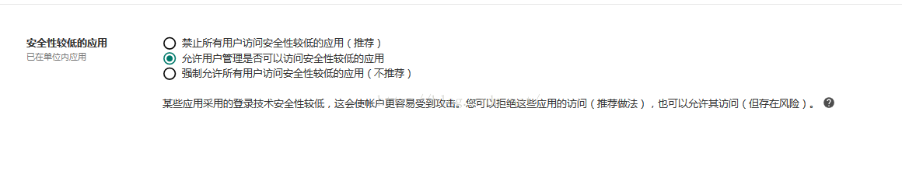
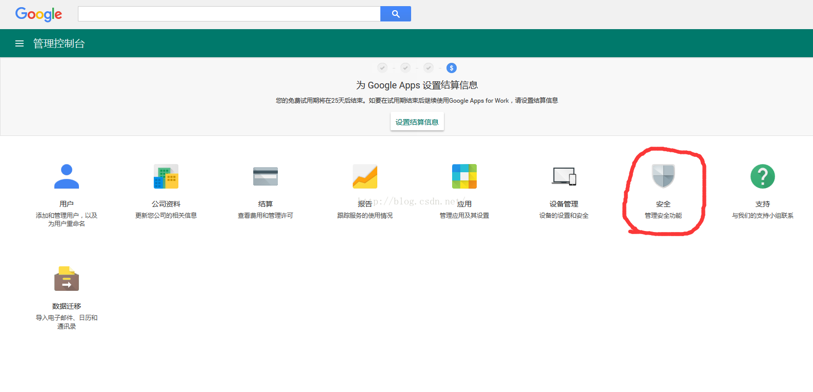
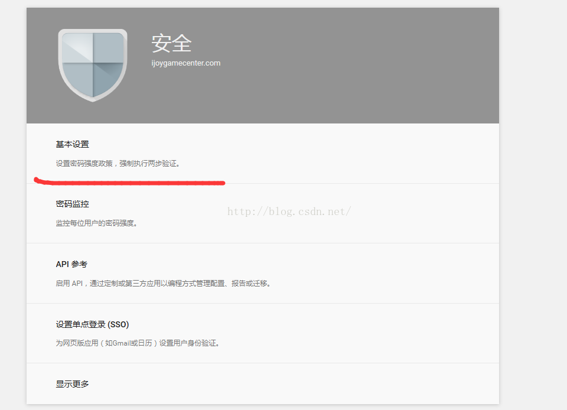
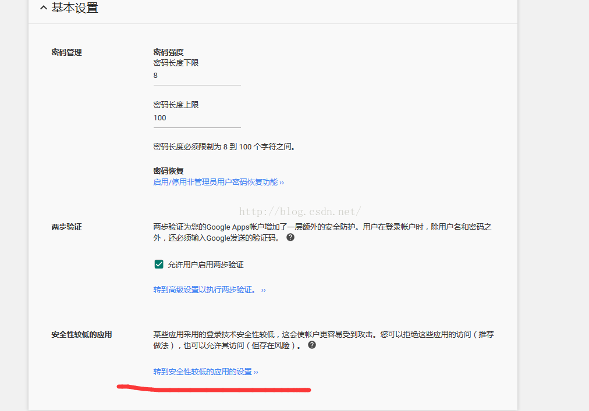

## 谷歌邮箱开启“访问安全性较低的应用”

当开发需要通过代码调用gmail的smtp邮件服务器时，经常被谷歌判定为低安全的应用而被拒绝登录，那么需要在谷歌账号中设置“允许安全性较低的应用”

### 1. 个人Gmail邮箱设置方法

在登录状态下，输入地址：

https://www.google.com/settings/security/lesssecureapps

然后选择开启即可。

### 2. 企业邮箱设置方法

a. 登录企业账号，登录地址

[admin.google.com](https://admin.google.com/)

b. 选择安全

c. 进入安全的设置页面，选择二次验证配置

d. 配置页面拉到最下方，选择"转到低安全应用配置"

e. 选择第二或第三个选项

f. 配置完成后，退出管理员账号。然后登录企业下的个人账号，后续步骤和个人一致