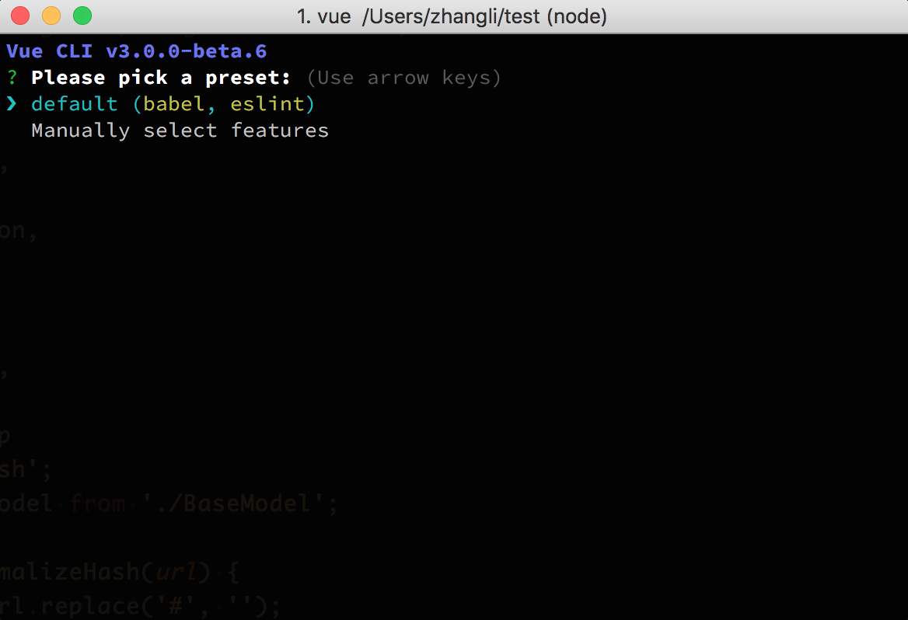
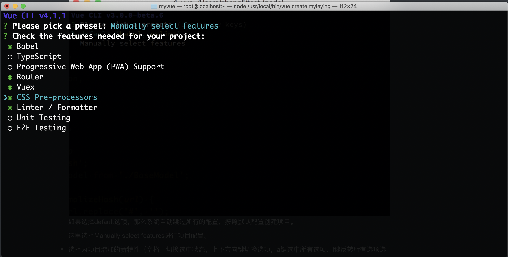
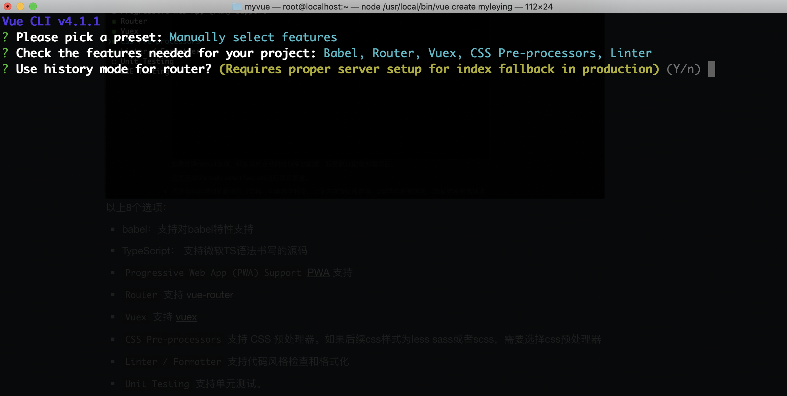
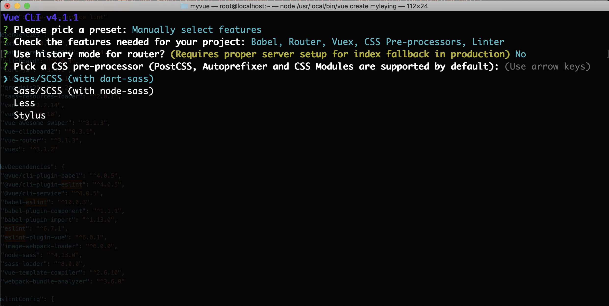
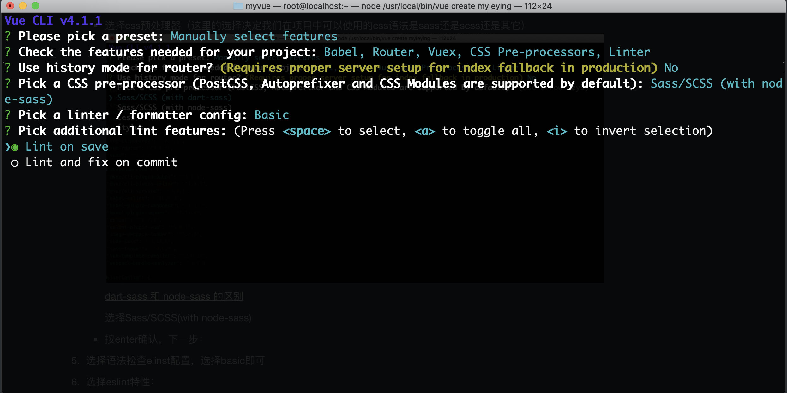
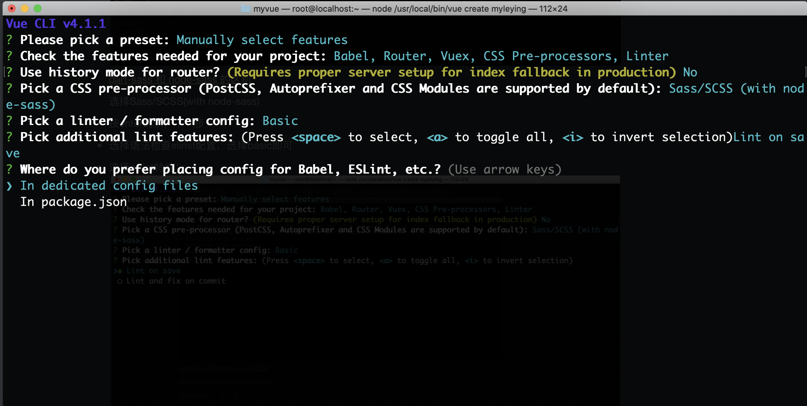

记第一次vue项目搭建

### 介绍

Vue CLI 是一个基于 Vue.js 进行快速开发的完整系统，所以在项目开始前需要安装vue-cli。

简而言之，VueCLI提供了一系列的工具和标准化方案（以及默认配置），让你在开发过程中更多的关注开发业务的。

Vue CLI提供：

1. 通过@vue/cli搭建交互式项目脚手架
2. 通过@vu e/cli+@vue/cli-service-globe快速开始零配置原型开发
3. 一个运行时依赖（@vu e/cli-servie)，该依赖：
   1. 可升级
   2. 基于webpack构建，并带有合理的默认配置；
   3. 可通过项目内的配置文件进行配置
   4. 可通过插件进行拓展
4. 一个丰富的官方插件集合，集成了前端生态中最好的工具
5. 一套完全图形化的创建和管理Vue.js项目的用户界面

Vue CLI组成部分：

1. CLI
   通过vue命令
2. CLI服务
   提供CLI插件的核心服务，优化过的webpack默认配置，项目内部的vue-cli-service提供serve、build和inspect命令
3. CLI插件


### 安装

1. 安装cli

   ```
   npm install -g @vue/cli
   ```

   ps:注意安装的是@vue/cli，不是cli。

2. 使用vue命令查看安装版本(这里要求使用3.0版本以上)

   ```
   vue --version
   ```

3. 通过vue初始化项目
   使用命令：`vue create <app-name>`

   ```
   vue create mypro
   ```

4. 项目配置

   * 选择预设

     
     如果选择default选项，那么系统自动跳过所有的配置，按照默认配置创建项目。

     这里选择Manually select features进行项目配置。

   * 选择为项目增加的新特性（空格：切换选中状态，上下方向键切换选项，a键选中所有选项，i键反转所有选项选中状态）
     
      以上8个选项：

     * babel：支持对babel特性支持
     * TypeScript： 支持微软TS语法书写的源码
     * `Progressive Web App (PWA) Support` [PWA](https://developers.google.com/web/progressive-web-apps/) 支持
     * `Router` 支持 [vue-router](https://router.vuejs.org/zh-cn/) 
     * `Vuex` 支持 [vuex](https://vuex.vuejs.org/zh-cn/intro.html) 
     * `CSS Pre-processors` 支持 CSS 预处理器。如果后续css样式为less sass或者scss，需要选择css预处理器
     * `Linter / Formatter` 支持代码风格检查和格式化
     * `Unit Testing` 支持单元测试。
     * `E2E Testing` 支持 E2E 测试

   * 按下enter键，确认，进入下一步：
     
     是否使用history模式的路由？[关于history和非history模式区别](https://juejin.im/post/5caf0cddf265da03474def8a)。
     这里我们使用非history模式，选择no

   * 选择css预处理器（这里的选择决定我们在项目中可以使用的css语法是sass还是scss还是其它）
     

     [dart-sass 和 node-sass 的区别](https://blog.csdn.net/github_37360787/article/details/102523308)

     选择Sass/SCSS(with node-sass)

   * 按enter确认，下一步：

   * 选择语法检查elinst配置，选择basic即可

   * 选择eslint特性：
     
     选择第一个即可。

   * 选择将babel以及eslint配置：

     1. 额外独立的配置文件 (推荐)
     2. 在package.json文件中

     

   * 最后询问：是否将配置保存起来，供下个项目使用：

     ```
     ? Save this as a preset for future projects? (y/N) 
     ```

   * 最终选择项如下：

     ```
     ? Please pick a preset: Manually select features
     ? Check the features needed for your project: Babel, Router, Vuex, CSS Pre-processors, Linter
     ? Use history mode for router? (Requires proper server setup for index fallback in production) No
     ? Pick a CSS pre-processor (PostCSS, Autoprefixer and CSS Modules are supported by default): Sass/SCSS (with nod
     e-sass)
     ? Pick a linter / formatter config: Basic
     ? Pick additional lint features: (Press <space> to select, <a> to toggle all, <i> to invert selection)Lint on sa
     ve
     ? Where do you prefer placing config for Babel, ESLint, etc.? In dedicated config files
     ? Save this as a preset for future projects? Yes
     ? Save preset as: 
     ```

     

5. 


### 参考

1. [JavaScript 模块化入门Ⅰ：理解模块](https://zhuanlan.zhihu.com/p/22890374)
2. [JavaScript 模块化入门Ⅱ：模块打包构建](https://zhuanlan.zhihu.com/p/22945985)