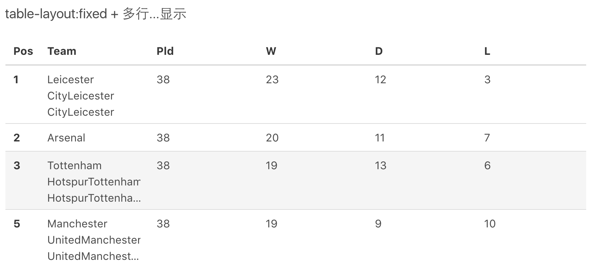

## table布局

#### table标签（display:table）

1) table可设置宽高、margin、border、padding等属性。属性值的单位可以使用px，百分比值。
2) table的宽度默认由内容的宽高撑开，如果table设置了宽度，宽度默认被它里面的td平均分，如果给某一个td设置宽度，那么table剩余的宽度会被其他的td平均分（有点类似flex布局）
3) 给table设置的高度起到的作用只是min-height的作用，当内容的高度高于设置的高度时，table的高度会被撑高。


#### tr标签（display:table-row）

1) 给tr设置高度只起到min-height的作用，默认会平分table的高度。
2) tr中的td默认高度会继承tr的高度，若给任一td设置了高度，其他td的高度也同样变高。适合多列等高布局
3) 设置宽度、margin、都不起作用


#### td标签（display:table-cell）

1) td默认继承tr的高度，且平分table的宽度
2) 若table（display:table）不存在，给td设置的宽高不能用百分比只能用准确的数值
3) 给td设置vertical-align: middle; td元素里面(除float、position:absolute)所有的块级、非块级元素都会相对于td垂直居中
4) 给td设置text-align: center; td元素里面所有非block元素(除float、position:absolute)都会相对于td水平居中，虽然block元素不居中，但其中的文字或inline元素会水平居中


注意：

1. text-align、vertical-align等对齐属性起作用，margin不起作用。宽高百分比值不起作用。
2. 会生成虚拟的table、tr把自己包裹住，如果有相邻的兄弟元素也被设置了table-cell,则会跟兄弟元素一起生成虚拟的table、tr把自己包裹住，并一行等高显示
3. 多个table-cell元素会占满被设置了display: table的元素的宽度，如果一个元素被设置了宽度，那么其他剩余的table-cell元素会占满剩下的宽度。当然，如果只有一个table-cell元素，就算设置了宽度也会占满table元素的宽度。
   1. 对设置了float、absolute的元素不起作用。且IE6、7不支持


table标签的table-layout属性：

| 属性    |                    描述                    |
| :------ | :----------------------------------------: |
| auto    |        默认 列宽度由单元格内容设定         |
| fixed   |         列宽由表格宽度和列宽度设定         |
| inherit | 规定应该从父元素继承 table-layout 属性的值 |

**auto**

大多数浏览器采用自动表格布局算法对表格布局。
表格及单元格的宽度取决于其包含的内容。
此算法有时会较慢，这是由于它需要在确定最终的布局之前访问表格中所有的内容。
微软公司声称使用这个命令，表格的显示速度可以加快100倍。

为了加快表格显示，最好事先就在CSS（或者table标签的width和height属性）中指定表格的宽度和高度。)

**fixed**

表格和列的宽度通过表格的宽度来设置，某一列的宽度仅由该列首行的单元格决定。在当前列中，该单元格所在行之后的行并不会影响整个列宽。

使用 `fixed` 布局方式时，整个表格可以在其首行被下载后就被解析和渲染。这样对于 `automatic` 自动布局方式来说可以加速渲染，但是其后的单元格内容并不会自适应当前列宽

任何一个包含溢出内容的单元格可以使用 `overflow` 属性控制是否允许内容溢出 或者 使用 `word-break:break-all` 使内容换行


### fixed + break-all

fixed布局带来的问题是单元格内容较长，英文或数字中间没有空格，是一连串的数字编码或字符时，不会换行，会溢出，所以加上 `word-break: break-all` 强制其换行显示


### fixed + 不换行…显示

`fixed + break-all` 解决了字符换行的问题，但是如果内容过长，容易撑高行的高度，导致表格某几行或所有行的高度过高，致表格变形，影响阅读体验，所以可以让过长的内容以 `...` 显示

```
<table style="table-layout:fixed;"></table>
```

为内容过长的 `td` 添加样式 `.ell`

```
.ell {
	overflow: hidden;
	text-overflow: ellipsis;
	white-space: nowrap;
}
```

### fixed + 多行 … 显示 【推荐】

如果单行…显示，可以保证所有行的高度一致，但当内容较多时，只能显示少量信息，也不利于阅读体验， 这样就需要单元格内容显示多行，超过规定行数再以 `...` 显示

```html
<table style="table-layout:fixed;"></table>
```

为单元格内容添加 `mult-ell-3` 的样式，当内容多行三行时显示 `...`, 并设置title属性，鼠标悬停时显示全部内容，这样即兼顾了表格整体美观度也满足了用户的阅读体检

```css
.mult-ell-3 {
	 display: -webkit-box;
	-webkit-line-clamp: 3;
	-webkit-box-orient: vertical;
	overflow: hidden;
}
```



### 参考

1. [table布局](http://coderlt.coding.me/2017/11/20/table-colgroup/)